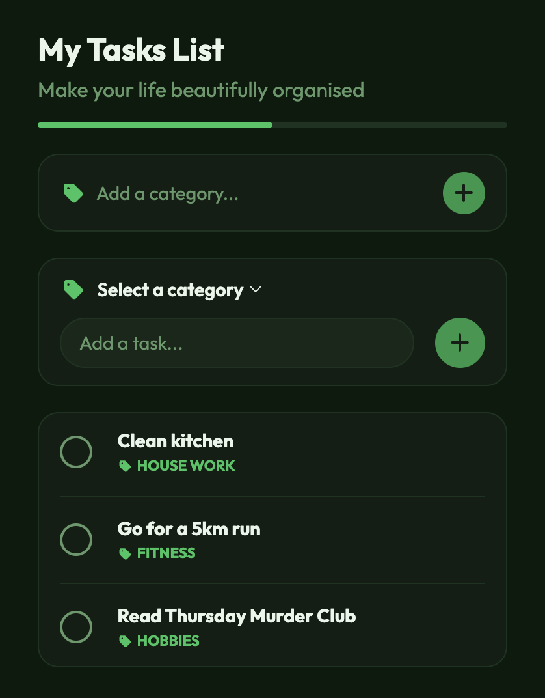
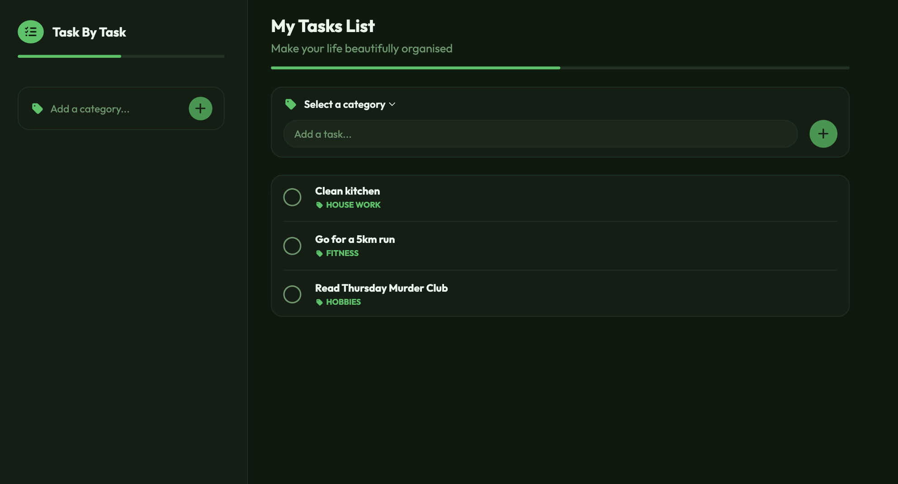

# Full-Stack Todo Application

## Demo & Snippets

- **Live Demo:** To be added
- **App Preview:**





---

## Requirements / Purpose

### MVP & Purpose

This application is a full-stack task management system designed to help users organise their daily tasks efficiently. Users can manage tasks through full CRUD (Create, Read, Update, Delete) operations and create custom categories to organise their workload.

### Tech Stack

- **Frontend:** React, TypeScript, React Query (TanStack Query), React Hook Form, React Testing Library, SCSS.
- **Backend:** Java, Spring Boot, Spring Data JPA, MySQL, OpenAPI/Swagger.
- **Testing & Tools:** Vitest, REST Assured, Maven, Git, GitHub Actions.

**Why this stack?**

- **TypeScript & Java:** Provides strong end-to-end type safety, reducing runtime errors across the stack.
- **Spring Boot:** Offers a robust, scalable backend framework with seamless database integration via JPA.
- **React Query:** Simplifies asynchronous state management by handling cache invalidation and automatic refetching upon database mutations.

---

## Build Steps

### Prerequisites

- Java JDK 17+
- Node.js (v18+) & npm
- MySQL Server running locally

### Backend Setup

1. Navigate to the root directory:

   ```bash
   cd todos
   ```

2. Build and run the Spring Boot application

   ```bash
   mvn spring-boot:run
   ```

3. Once the server is running, access the interactive Swagger API documentation and endpoint testing interface at: http://localhost:8080/swagger-ui/index.html#/

### Frontend Setup

1. Open a new terminal window and navigate to the frontend directory:

   ```bash
   cd frontend
   ```

2. Install dependencies:

   ```bash
   npm install
   ```

3. Run the development server:

   ```bash
   npm run dev
   ```

---

## Design Goals / Approach

- **Mobile-First Responsive Design:** Styled to prioritise clean layout and user experience on smaller screens before expanding to desktop views.
- **Automated Cache Management:** Leverages React Query custom hooks (`useTodos`, `useCreateTodo`, `useUpdateTodo`, `useDeleteTodo`, `useCategories`, `useCreateCategories`) to invalidate query caches automatically upon successful mutations, ensuring instantaneous UI updates.
- **Separation of Concerns:** Clean architecture separating data fetching (services), state/cache logic (hooks), and UI components.

---

## Features

- **Category Management:** Create and assign tasks under specific categories.
- **Todo CRUD Operations:** Full capability to create, view, update, and delete todos.
- **Mobile-First Layout:** Responsive interface optimised for mobile screens before expanding to larger screen sizes.
- **Cache Invalidation:** Automatic frontend UI updates immediately following backend database changes.
- **Swagger Documentation:** Interactive API testing interface.

---

## Known Issues

- **Error Handling:** User-facing error messaging and fallback UI states are currently basic and need further refinement.
- **Incomplete Features:** UI controls for editing and deleting existing categories are currently undergoing backend-to-frontend integration.

---

## Future Goals

- **Live Demo Deployment:** Add a live demo of the application.
- **Dynamic Completion Bar:** A progress bar that calculates and updates in real-time based on the percentage of completed tasks.
- **Dashboard Summary:** A top-level summary section breaking down task statistics by category.
- **Category Filtering:** Ability to filter todo list by selecting specific categories.
- **Database Persisted States:** Implement `isChecked` state and `isArchived` soft deletes in the MySQL database schema and apply applicable logic to the UI.

---

## Change Logs

**10/08/2026 - Backend Setup & Category Endpoints**

- Established MySQL database connection and initial Spring Boot architecture.
- Implemented Category REST endpoints, base data models, and custom exception handling.
- Integrated Swagger UI support for endpoint documentation.

**11/08/2026 - Todo API & Error Handling**

- Built out Todo REST endpoints and data seeding.
- Added ModelMapper DTO conversion and standardised API error response structures.
- Integrated REST Assured testing framework with initial integration test suites.

**13/08/2026 - Service Testing & Frontend Setup**

- Added complete end-to-end and service-layer test coverage for todos and categories.
- Initialized frontend React TypeScript application with component scaffolding.

**14/08/2026 - UI Layout & React Query Integration**

- Built out responsive styles targeting mobile viewports up to large-laptop screens.
- Integrated React Query to consume GET and POST API endpoints for categories.

**15/08/2026 - Category Testing & Todo Fetching**

- Expanded frontend unit test coverage for category state logic.
- Integrated React Query hooks for fetching and creating todos.

**16/08/2026 - Todo Edit & Deletion Endpoint Consumption**

- Connected UI components to PATCH and DELETE Todo API endpoints.
- Expanded component test suites for edit and deletion states.

**17/08/2026 - Category Edit Deletion & Filtering**

- Connected UI components to PATCH and DELETE Category API endpoints.
- Updated and consumed Todos GET endpoint to incorporate optional category filtering
- Expanded component test suites for edit and deletion states.

---

## What did you struggle with?

- **React Query Integration & Testing:** Mocking custom asynchronous hooks and managing `QueryClient` cache invalidation states inside component test wrappers.
- **React Component and SCSS Maintenance:** Refactoring initial component structure and styling to support additional interactivity within the app.

---

## Licensing Details

This project is licensed under the [MIT License](LICENSE) - a standard open-source license that allows anyone to view, modify, and distribute the code.

---

## Further details, related projects, reimplementations

- **Backend API:** Spring Boot REST API serving endpoints at `/todos` and `/categories`.
- **Frontend Application:** React single-page application consuming the Spring Boot REST endpoints.
